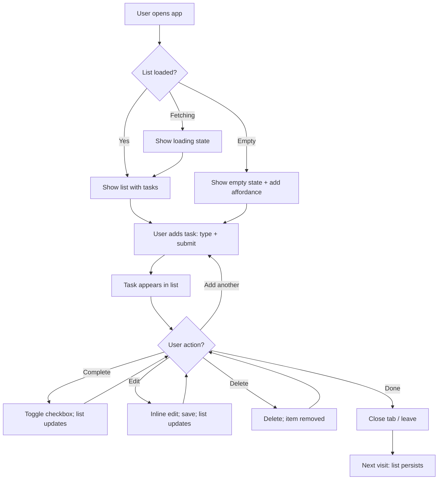
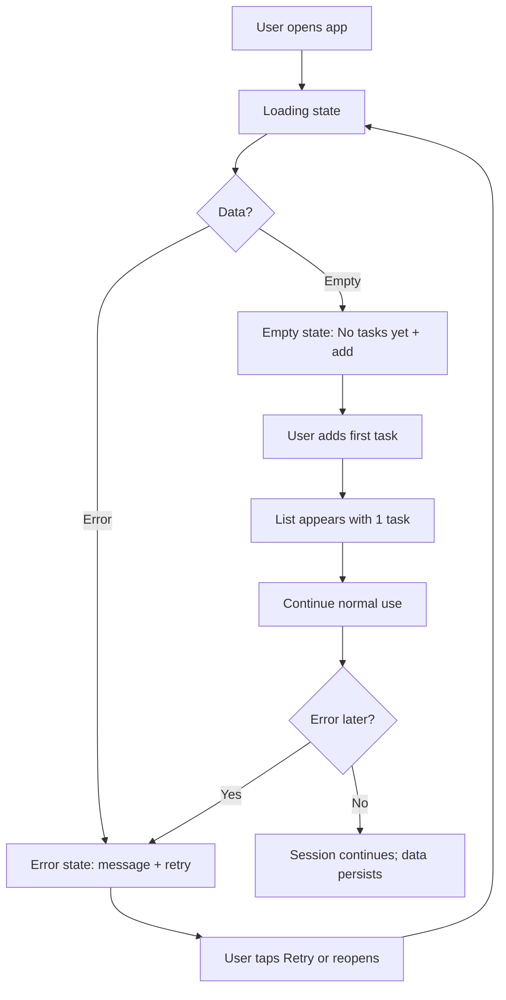

# UX Design Specification aine-training

**Author:** Ben
**Date:** 2026-03-17

---

## Executive Summary

### Project Vision

A full-stack Todo app built for maximum simplicity: as simple as possible while still complete and reliable. The product is for individual users managing personal tasks. The main promise is minimal, reliable task management that stays out of the way—a clean core experience that can be extended later (e.g. auth, multi-user) without redesign. Simplicity is the product; the app does not need to outperform others, only to be "just as good" and clearly focused on the core job: create, view, complete, and delete tasks.

### Target Users

**Task manager** — Someone who wants to capture and manage personal tasks with minimal friction (the product owner or anyone who wants the same). No login in v1; one list per session/browser until auth exists. Users should be able to use the app without explanation or onboarding; the UI must be self-explanatory.

### Key Design Challenges

- **Self-explanatory UI with zero onboarding** — Every screen and control must be obvious at a glance; no tutorials or documentation.
- **Immediate list load and fast add** — List visible on open with no perceptible delay; add task in under 10 seconds and in one or two actions, with clear empty, loading, and error states.
- **Minimal yet complete flows** — Add, complete, delete, and edit each in one or two actions, on both desktop and mobile (responsive, touch-friendly), without extra steps or deep menus.
- **Accessibility without clutter** — Meet WCAG 2.1 Level AA (keyboard, focus, contrast, semantics) while keeping the interface minimal and calm.

### Design Opportunities

- **Simplicity as differentiator** — Use the "as simple as possible" constraint to drive clear hierarchy, obvious affordances, and no dead ends.
- **Trust through state clarity** — Strong empty, loading, and error states that explain what's happening and how to recover (e.g. retry, add first task).
- **Instant feedback** — Optimistic UI or fast responses so list, add, complete, delete, and edit feel immediate and reliable.

---

## Core User Experience

### Defining Experience

The core experience is the task list: viewing it, adding to it, and acting on items (complete, edit, delete) with minimal steps. The primary loop is open → see list → add or act. The one interaction that must feel effortless is adding a task: one or two actions, and the task appears in the list in under 10 seconds. The list itself should be visible immediately on open with no blocking delay.

### Platform Strategy

Web only: a single-page application (SPA) used in desktop and mobile browsers. One responsive experience; no separate native app. Interactions must work for both pointer/keyboard and touch (e.g. touch-friendly targets, readable text). Target is latest major browsers (Chrome, Firefox, Safari, Edge) and mobile browsers (e.g. iOS Safari, Android Chrome). Offline support is out of scope for v1.

### Effortless Interactions

- **List on open** — List (or empty state) visible immediately; loading state when data is fetching.
- **Add task** — Focus + type + submit (or equivalent); new task appears in list right away; no extra steps or confirmation unless necessary.
- **Complete / delete / edit** — Each in one or two actions (e.g. checkbox to complete, one-tap delete, inline or single-step edit); no deep menus or multi-step flows.
- **Empty, loading, error** — Clear states with obvious next step (e.g. "No tasks yet" + add affordance; retry on error).

### Critical Success Moments

- **First open** — User sees the list or a clear empty state and immediately knows how to add a task.
- **First add** — User adds a task and sees it in the list quickly; no confusion about whether it worked.
- **First complete/delete** — One action changes the list; completed vs active is obvious at a glance.
- **When something fails** — Error state is clear and offers a path to retry or recover; user is never stuck on a blank or cryptic screen.

### Experience Principles

- **Immediate** — List and feedback feel instant; no artificial delay.
- **Minimal steps** — Add, complete, delete, edit in one or two actions; no unnecessary flow.
- **Obvious** — Every screen and control is self-explanatory; no onboarding or docs required.
- **Recoverable** — Empty, loading, and error states are clear and point to a next action.

---

## Desired Emotional Response

### Primary Emotional Goals

- **In control** — Users feel they can capture and manage tasks without the tool getting in the way. The app supports their intent rather than demanding attention.
- **Calm and focused** — The experience is minimal and predictable. No visual noise or surprise; the list is the focus.
- **Confident** — Actions do what users expect. Add, complete, delete, edit work the first time and persist; the system feels reliable.

### Emotional Journey Mapping

- **First discovery / open** — Reassured: list appears (or a clear empty state); they immediately know what to do. No confusion about whether the app is working.
- **During core use** — Focused and efficient: adding and acting on tasks feels quick and obvious; the tool stays in the background.
- **After completing a task** — Satisfied: the list updates, completed vs active is clear; no need to double-check.
- **When something goes wrong** — Supported, not stuck: error state is clear and suggests a next step (e.g. retry); no blank screen or unexplained failure.
- **Returning later** — Trust: their list is still there; the product feels dependable and low-friction.

### Micro-Emotions

- **Confidence over confusion** — Self-explanatory UI and clear empty/loading/error states so users never wonder "is it broken?" or "what do I do next?"
- **Trust over skepticism** — Persistence and clear feedback (e.g. optimistic UI or fast confirmation) so users trust that their actions were saved.
- **Satisfaction over frustration** — One or two actions per task operation; no hidden steps or dead ends.
- **Calm over anxiety** — No urgency patterns, no overwhelming density; the interface stays minimal and scannable.

### Design Implications

- **In control** → Few, clear affordances; no unnecessary modals or confirmations for core flows; keyboard and touch both supported.
- **Calm and focused** → Restrained visual design; clear hierarchy (list + add + per-item actions); consistent patterns so nothing feels surprising.
- **Confident** → Immediate feedback on add/complete/delete/edit; clear loading and error states with recovery path; no silent failures.
- **Trust** → Data persists and is visible after refresh; error messages explain what happened and what to do next.

### Emotional Design Principles

- **Reassure, don't surprise** — Predictable behavior and clear state at every step.
- **Support, don't demand** — No onboarding or prompts unless necessary; the UI explains itself.
- **Recover, don't abandon** — Errors and empty states always point to a clear next action.
- **Stay quiet** — Avoid delight-for-delight's-sake; satisfaction comes from simplicity and reliability.

---

## UX Pattern Analysis & Inspiration

### Inspiring Products Analysis

Drawing on patterns from minimal, list-first products (e.g. focused todo and note apps that prioritize a single list and fast capture):

- **Single-surface focus** — The list is the main (often only) view; add and act without leaving the list. Supports "immediate" and "obvious" from our experience principles.
- **Fast capture** — Input at top or bottom of list, single field + submit (or Enter). No modal or extra screen to add a task. Aligns with add in one or two actions.
- **Clear completed state** — Checkbox (or equivalent) plus visual distinction (strikethrough, muted style, or grouping) so completed vs active is obvious at a glance.
- **Inline or one-step edit** — Click-to-edit in place or a single explicit edit action; no multi-step wizard. Supports minimal steps and confidence.
- **Restrained empty and error states** — Empty: short message + clear add affordance. Error: what went wrong + retry or recovery. Supports calm and recoverable experience.
- **Quiet visual design** — Plenty of whitespace, limited chrome, clear typography hierarchy. Supports calm and focus without clutter.

### Transferable UX Patterns

**Navigation / structure**

- **Single primary view** — One list view as home; no tabs or sections required for MVP. Keeps the experience self-explanatory.
- **Add always visible** — Add control (field or button) consistently placed (e.g. top of list) so "how do I add?" is never a question.

**Interaction**

- **Checkbox to complete** — Familiar, one action, keyboard- and touch-friendly; supports WCAG when implemented with semantics and focus.
- **Inline edit on focus or tap** — Edit in place so the list stays the single source of truth; no separate edit screen for MVP.
- **Explicit delete** — One control per item (e.g. icon or button); optional lightweight confirmation if needed, but avoid deep menus.

**Visual**

- **Completed vs active styling** — Strikethrough and/or reduced opacity for completed; active items remain primary. Supports "at a glance" distinction.
- **Loading and error as states** — Skeleton or spinner for loading; inline or banner for error with message + retry. No blank or cryptic screens.

### Anti-Patterns to Avoid

- **Modal or multi-step add** — Adding a task should not require opening a modal or wizard; avoid friction and extra clicks.
- **Hidden or undiscoverable actions** — No hover-only or long-press-only for primary actions; complete, edit, delete should be visible or clearly reachable.
- **Unclear list state** — Avoid showing a blank area without explaining empty vs loading vs error; always show a clear state and next step.
- **Overbuilt chrome** — No sidebars, multiple tabs, or heavy navigation for MVP; reduces clarity and conflicts with "minimal."
- **Silent failure** — Failed save or load must surface a clear error and retry path; never leave the user wondering if data was lost.
- **Relying on color alone** — Completed/active and interactive states must not depend only on color (support WCAG and accessibility).

### Design Inspiration Strategy

**Adopt**

- Single-list view with add at top or bottom; checkbox for complete; inline or one-step edit; one delete control per item.
- Clear empty state ("No tasks yet" + add); loading indicator while fetching; error message + retry.
- Restrained layout and typography; completed/active distinction via strikethrough and/or opacity plus semantics.

**Adapt**

- Keep patterns minimal: no sections, filters, or themes in MVP; add only if they don't add visual or interaction noise.
- Ensure touch targets and keyboard flow support responsive and WCAG 2.1 AA without extra UI clutter.

**Avoid**

- Modals or wizards for core add/edit; hover-only or obscure gestures for primary actions; blank or unexplained states; heavy navigation or chrome; delight that adds steps or distraction.

---

## Design System Foundation

### Design System Choice

**Utility-first CSS + minimal component layer** (e.g. Tailwind CSS or equivalent with a small set of custom components). Prefer a themeable, low-chrome approach over a full component library (Material, Ant, etc.) so the UI can stay minimal and the list remains the clear focus.

### Rationale for Selection

- **Minimal UI** — Full component libraries tend to add chrome and patterns that conflict with "as simple as possible." A utility-first base plus a few components (list, input, button, checkbox, error/empty states) keeps the interface restrained.
- **Stack-agnostic** — Utility CSS and design tokens work with any SPA framework (React, Vue, etc.); the PRD does not mandate a specific stack, so the design system should not either.
- **Speed and consistency** — Utility classes and a small component set give consistent spacing, type, and color without a large dependency or heavy theming. Good fit for a small/solo team.
- **Accessibility** — Components can be implemented with semantic HTML and ARIA where needed; the design spec (WCAG 2.1 AA) drives the implementation rather than a pre-built library's defaults.
- **Calm visual design** — Full control over typography, contrast, and density supports the desired emotional response (calm, focused) without fighting a library's default look.

### Implementation Approach

- **Design tokens** — Define a small set of tokens for color (background, text, border, states), typography (font family, sizes, weights), spacing, and focus/error. Use these in utility classes and components.
- **Component set** — Only what's needed for MVP: list container, list item (checkbox + label + edit + delete), add-task input, buttons/links, loading indicator, error/empty messaging. No tabs, modals, or complex navigation components for v1.
- **Documentation** — Document tokens and component usage (and keyboard/ARIA behavior) so implementation stays consistent and accessible.

### Customization Strategy

- **Theming** — Single theme for v1 (light preferred for readability; dark optional later). Tokens make it easy to add a dark theme without redesign.
- **No brand lock-in** — No dependency on a specific design language; the product's identity is "minimal and reliable," expressed through restraint and clarity rather than a third-party system's aesthetics.
- **Extend only when needed** — Add new components (e.g. filter controls) only when required by a feature; keep the design system as small as the product scope.

---

## Defining Core Experience

### Defining Experience

The defining experience is **"See the list, add or act in one or two actions."** The core action users will describe is: *"I add a task and it's there—I can complete or delete it in a click."* If one thing is nailed, it's **adding a task**: visible input, type, submit (or Enter), and the task appears in the list immediately. The list is always the single surface; no navigation, modals, or wizards for core actions.

### User Mental Model

- Users bring a **list metaphor**: tasks in order, checkbox = done, type and submit = new item. They expect the app to behave like a simple list (paper or familiar apps).
- They expect **immediate feedback**: after add or complete, the list updates; after refresh, data is still there. Confusion comes from blank screens, unclear empty/loading/error, or actions that don't visibly take effect.
- **Existing solutions**: Many todo apps add projects, labels, and UI chrome. Users who want "minimal" dislike that; they expect "one list, add, complete, delete, done."

### Success Criteria

- **"This just works"** — List (or empty state) appears on open; add shows the new task in the list right away; complete/delete/edit update the list visibly.
- **Feels fast** — No perceptible delay to see the list; add-to-list in under 10 seconds; complete/delete/edit feel instant (e.g. optimistic UI or fast response).
- **Obvious outcome** — Completed vs active is clear at a glance; empty state says "No tasks yet" and shows how to add; errors show what went wrong and how to retry.
- **No explanation needed** — First-time user can add, complete, edit, and delete without reading anything.

### Novel UX Patterns

**Established patterns.** The product uses familiar list + checkbox + inline-edit patterns. No new interaction paradigm.

- **Adopt**: Single list view; add at top or bottom with one field + submit; checkbox for complete; inline or one-step edit; one delete control per item; clear empty/loading/error states.
- **Unique twist**: Strict minimalism—no extra chrome, no modal add, no hidden actions. The "innovation" is restraint and consistency, not a new gesture or flow.

### Experience Mechanics

**1. Initiation**

- **Open app** — User opens URL/bookmark. Trigger: page load. Invitation: list appears or empty state with clear add affordance (e.g. input at top).
- **Add task** — User focuses add field (or taps it). Trigger: focus or tap. Invitation: placeholder or label (e.g. "Add a task") so the action is obvious.

**2. Interaction**

- **Add** — User types description, submits (Enter or button). System adds task via API and updates list (optimistic or on response). New task appears in list; input clears.
- **Complete** — User toggles checkbox (or equivalent). System updates status via API; list re-renders with completed styling (e.g. strikethrough, muted).
- **Edit** — User activates edit (e.g. click label, or edit control). Inline field or single-step edit; submit saves and updates list.
- **Delete** — User activates delete (e.g. icon/button). Optional lightweight confirmation; system removes task and updates list.

**3. Feedback**

- List state always visible (list, empty, loading, error). After add/complete/edit/delete, list updates immediately; no silent failure. Loading: spinner or skeleton. Error: message + retry.

**4. Completion**

- **Add** — New task visible in list; input ready for next. **Complete** — Item marked done, visually distinct. **Edit** — Updated text in list. **Delete** — Item removed. User stays on the same list view; no transition to another screen.

---

## Visual Design Foundation

### Color System

- **No brand palette** — Use a neutral, low-chroma palette so the list and content stay in focus. Backgrounds and text should meet WCAG 2.1 AA (e.g. 4.5:1 for body text, 3:1 for large text and UI components).
- **Semantic mapping** — **Background**: light neutral (e.g. off-white or very light gray) for the page; **Surface**: same or subtly distinct for the list/card area. **Text**: dark gray or black for primary; muted gray for secondary (e.g. completed tasks, metadata). **Border**: light gray for dividers and inputs. **Primary action**: one accent for the main add/submit action (e.g. blue or green); ensure contrast against background. **Focus**: visible focus ring (e.g. 2px outline) that doesn't rely on color alone. **Error**: red or equivalent for error text and error state; **Success/complete**: optional subtle green or rely on strikethrough/muted only.
- **Tokens** — Define tokens for background, surface, text-primary, text-secondary, text-muted (completed), border, primary, focus-ring, error. Use these in the utility/component layer so theming (e.g. dark mode later) stays consistent.

### Typography System

- **Tone** — Clear and readable; neutral, not playful. Supports "calm and focused" and self-explanatory UI.
- **Primary typeface** — System font stack (e.g. -apple-system, BlinkMacSystemFont, "Segoe UI", Roboto, sans-serif) for fast load and familiarity; or one web-safe serif/sans if a slight character is desired. Avoid decorative or heavy fonts.
- **Scale** — Small set: **Page/section title** (e.g. 1.25rem–1.5rem, bold) if needed; **List / body** (1rem, regular); **Input/label** (1rem); **Metadata / secondary** (0.875rem, muted). No need for many heading levels in MVP.
- **Line height** — Comfortable for list and input (e.g. 1.4–1.5 for body); enough for touch targets when line height affects tap area.
- **Accessibility** — Minimum 16px (1rem) for body/input to avoid zoom issues; sufficient contrast for all text; don't rely on font weight alone for meaning (pair with color or style).

### Spacing & Layout Foundation

- **Base unit** — 4px or 8px base. Apply in multiples (e.g. 8, 16, 24, 32) for padding and margins so the layout stays consistent.
- **Density** — Airy rather than dense: enough space between list items and around the add field so the list is scannable and touch-friendly (e.g. min 44px touch target for interactive elements).
- **Layout** — Single column for the list; max-width container (e.g. 480px–560px) for readability on desktop; full-bleed on small screens if preferred. Add input fixed at top (or bottom) of list; list scrolls beneath. No sidebar or multi-column for MVP.
- **Grid** — Optional simple grid for alignment; not required for a single-column list. If used, align to the same base unit (e.g. 8px grid).

### Accessibility Considerations

- **Contrast** — All text and UI components meet WCAG 2.1 AA (4.5:1 normal text, 3:1 large text and UI). Check primary action and error colors against background.
- **Focus** — Visible focus indicator on all interactive elements (checkbox, input, button, delete, edit); keyboard order matches visual order.
- **Semantics** — Use list markup (ul/ol, li), labels for inputs, and buttons/links for actions so screen readers and keyboard users get a clear structure.
- **State** — Completed vs active communicated by more than color (e.g. strikethrough, icon, or text); error state by icon + text + focus management where appropriate.

---

## Design Direction Decision

### Design Directions Explored

Three directions were generated in `ux-design-directions.html`:

- **Direction A — Minimal, add at top:** Single list, add input and primary button at top; flat list rows with checkbox, label, delete; strikethrough/muted for completed; neutral background, one accent for the Add button.
- **Direction B — Add at bottom, slightly denser:** Same list pattern with add row fixed at bottom; slightly tighter spacing and smaller type; green accent.
- **Direction C — Card-style list items:** Add at top; each task in a light card (background + border); more rounded corners and padding per item.

All three use the same interaction model (checkbox, inline text, delete control) and meet the visual foundation (tokens, typography, spacing, accessibility).

### Chosen Direction

**Direction C — Card-style list items.**

- Add control at top of list; list scrolls below.
- Each task is a **card**: light background, subtle border, rounded corners, comfortable padding. Cards are stacked with a small gap between them.
- One primary accent for the Add action (e.g. blue); otherwise neutral palette.
- Strikethrough and muted color for completed tasks; clear delete control per card.

### Design Rationale

- **Card style** — Each task reads as a distinct unit; helps scanning and touch targets while keeping the layout minimal. Aligns with "calm and focused" by giving each item clear boundaries without heavy chrome.
- **Add at top** — User sees the add control immediately; new tasks appear in a new card below, supporting the &lt;10s add success criteria.
- **Consistent with spec** — Same interaction model (checkbox, label, delete) and tokens; the card is a visual treatment only, not a new pattern.
- **Implementation reference** — See the Direction C block in `ux-design-directions.html` for exact styling (padding, border-radius, background, gap).

### Implementation Approach

- Implement layout and components per Direction C: add row (input + button) at top, then list of **cards** (one per task: checkbox + label + delete), with gap between cards.
- Use design tokens from the Visual Design Foundation; card surface uses the defined surface or a light variant (e.g. #fafafa, 1px border #eee, 8px border-radius).
- Ensure empty, loading, and error states use the same card/layout language where appropriate; keep add row and messaging consistent with the spec.
- Reference `ux-design-directions.html` (Direction C section) for the exact card styling when building the app.

---

## User Journey Flows

### Journey 1: Primary User — Success Path

User opens the app, sees the list (or empty state), adds and acts on tasks with minimal steps, then leaves; data persists.

**Flow:** Open app → List loads (or empty state) → Add task (type + submit) → Task appears in list → Complete / Edit / Delete as needed (each in one or two actions) → List stays in sync → Close tab; next open, list still there.

### Journey 2: Primary User — Edge Case (First Time + Error Recovery)

First-time open or after clearing data: empty state. Later, a network/server error: clear error state and retry; no dead screen.

**Flow:** Open app → Loading → Empty state ("No tasks yet" + add) → Add first task → List appears. [Later] Error occurs → Error state (message + retry) → User retries or waits → List loads again → Continue as normal.

### Journey Patterns

- **Single surface** — Every journey stays on the same list view; no navigation to other screens. Add, complete, edit, delete happen in place.
- **State-first** — UI always shows one of: loading, list, empty, error. No blank or ambiguous state; each state has a clear next action (add, retry, or use list).
- **Immediate feedback** — After any action (add, complete, edit, delete), the list updates right away (optimistic or fast response). User never waits without feedback.
- **Recovery path** — Error state always includes a retry or explanation; empty state always includes an add affordance. User is never stuck.

### Flow Optimization Principles

- **Minimize steps to value** — Add = focus + type + submit (no modal, no extra screen). Complete = one click/tap. Edit = activate edit, change, submit. Delete = one control, optional lightweight confirm.
- **Low cognitive load** — No decisions at entry (one list, one add field). Decisions are binary (complete or not, delete or not, edit or not) with obvious controls.
- **Clear feedback** — Loading = spinner/skeleton. Empty = message + add. Error = message + retry. List = tasks with visible completed vs active.
- **Graceful degradation** — On error, show message and retry; don't lose context. On empty, show add; don't leave user wondering if the app works.

---

## Component Strategy

### Design System Components

The foundation is **utility-first CSS + design tokens** (no full component library). Available building blocks:

- **Tokens** — Color (background, surface, text-primary, text-secondary, text-muted, border, primary, focus-ring, error), typography (font stack, sizes, weights, line heights), spacing (base unit and scale).
- **Primitives** — Styled via utilities: text inputs, buttons, checkboxes (or custom checkbox-style control), focus rings. No pre-built "TaskCard" or "TaskList"; those are custom.

**Coverage:** Inputs, buttons, and focus states are implemented with tokens. List structure (list container, list item, card) and task-specific UI are custom components.

### Custom Components

**1. AddTaskRow**

- **Purpose:** Single place to add a task (type description, submit).
- **Anatomy:** Text input (flex) + primary button ("Add"). Optional visible label or only placeholder ("Add a task").
- **States:** Default, focus (input), disabled (e.g. while submitting), error (validation or API error inline).
- **Accessibility:** Label or aria-label for input; button type="submit" or explicit submit; keyboard: Enter submits.
- **Behavior:** Submit adds task and clears input; list updates (optimistic or on response).

**2. TaskCard**

- **Purpose:** One task: completion toggle, label (editable), delete.
- **Anatomy:** Card container (Direction C: background, border, border-radius, padding) containing: checkbox (or equivalent), task text (or inline edit field), delete control (e.g. icon button).
- **States:** Default, completed (strikethrough + muted), editing (inline field focused), hover (optional: emphasize delete), focus (visible focus ring on interactive elements).
- **Accessibility:** Checkbox has label (task text or aria-label); delete has aria-label "Delete task"; keyboard: Tab order checkbox → text/edit → delete; Space toggles complete; Enter on label may start edit (or click).
- **Behavior:** Checkbox toggles complete; click label or edit control → inline edit → blur/Enter saves; delete removes item (optional confirm).

**3. TaskList**

- **Purpose:** Container for the list of TaskCards and list-level states.
- **Anatomy:** Wrapper (max-width, padding) containing: AddTaskRow, then list (ul or div with role="list") of TaskCards, or EmptyState / LoadingState / ErrorState.
- **States:** Loading (skeleton or spinner), empty (show EmptyState), error (show ErrorState), list (show cards).
- **Accessibility:** role="list" and list item semantics; live region or announcement when list count changes if helpful.
- **Behavior:** Renders one of loading / empty / error / list based on data and API state.

**4. EmptyState**

- **Purpose:** When there are no tasks, explain and point to add.
- **Content:** Short message (e.g. "No tasks yet") and visible add affordance (same AddTaskRow or prominent "Add your first task").
- **Accessibility:** Message readable by screen readers; add control is focusable.

**5. LoadingState**

- **Purpose:** While tasks are being fetched, show progress.
- **Content:** Spinner or skeleton list (e.g. 3–4 placeholder cards) so layout is stable.
- **Accessibility:** aria-live="polite" or aria-busy="true" and accessible loading text (e.g. "Loading tasks").

**6. ErrorState**

- **Purpose:** When list fails to load, explain and offer retry.
- **Content:** Message (e.g. "Couldn't load tasks") + Retry button.
- **Accessibility:** aria-live for error message; Retry is focusable and clearly labeled.
- **Behavior:** Retry triggers refetch; on success, show list.

### Component Implementation Strategy

- **Build custom components with tokens** — Use design tokens for all colors, type, and spacing so components stay consistent and themeable.
- **Direction C styling** — TaskCard uses card styling from ux-design-directions.html (Direction C); AddTaskRow and list spacing align with Visual Design Foundation.
- **Accessibility first** — Semantic HTML (form, input, button, ul/li or role="list"), ARIA where needed, keyboard and focus order per Flow Optimization Principles.
- **Reuse patterns** — AddTaskRow and TaskCard are the main interactive components; EmptyState, LoadingState, ErrorState are simple, consistent blocks used only by TaskList.

### Implementation Roadmap

- **Phase 1 — Core (MVP):** TaskList (with loading/empty/error branches), AddTaskRow, TaskCard. Enough to support both user journeys (success path and edge case).
- **Phase 2 — Polish:** Inline edit behavior refinements, delete confirmation if added, any microcopy or empty/error message tweaks.
- **Phase 3 — Enhancements:** Any post-MVP components (e.g. filter UI) only when a feature requires them; keep MVP set minimal.

---

## UX Consistency Patterns

### Button Hierarchy

- **Primary** — One primary action per context: "Add" in AddTaskRow, "Retry" in ErrorState. Use primary token (e.g. blue); sufficient contrast; clear label. Only one primary button visible at a time in the list view.
- **Secondary / ghost** — Delete and edit are secondary: no strong fill (e.g. icon or text only, muted). On focus/hover, visible but not competing with primary. Delete may use destructive color (e.g. red) on hover or in a confirm step if added later.
- **Consistency** — All primary actions use the same style; all secondary actions use the same style. No mixed button styles for the same action type.

### Feedback Patterns

- **Loading** — TaskList loading: spinner or skeleton cards; no blank area. Use aria-busy and/or "Loading tasks" for screen readers. AddTaskRow submitting: optional disabled state or inline spinner; avoid blocking the whole view.
- **Success** — Implicit: list updates (task added, completed, edited, deleted). No toast or modal required for MVP; the updated list is the feedback. Optional: brief non-blocking confirmation for delete if confirmation is added.
- **Error** — List load error: ErrorState with message + Retry. Add/edit/delete failure: inline near the control (e.g. under AddTaskRow or on the TaskCard); message + retry or "Try again." Use error token; ensure contrast and optional aria-live for announcements.
- **Empty** — EmptyState: short copy ("No tasks yet") + same AddTaskRow so the next action is obvious. No decorative illustration required for MVP unless it supports clarity.

### Form Patterns

- **Add task** — Single text input + submit (button or Enter). Placeholder "Add a task" or equivalent. No required validation for MVP beyond non-empty if desired; trim whitespace. On submit: clear input, update list (optimistic or on response). Inline error only if API returns error.
- **Inline edit** — Activate by click on label or dedicated edit control. Replace label with input (same styling as add input); save on blur or Enter, cancel on Escape. No modal; keep one active edit at a time per list. Validation: non-empty; show inline error or revert on invalid.
- **Labels and accessibility** — Associate label with input (visible or aria-label). Submit buttons have clear text ("Add", "Retry"). No placeholder-only labeling where it harms accessibility.

### Navigation Patterns

- **Single view** — No global nav, tabs, or sidebar for MVP. The only "screen" is the list view (with loading/empty/error/list states). All actions (add, complete, edit, delete) happen in place.
- **Focus order** — Add input → Add button → first task checkbox → task label/edit → delete → next task… Logical tab order so keyboard users can add and act on tasks without mouse.
- **No deep navigation** — No "back" or multi-step flows; if a pattern requires leaving the list (e.g. future filter view), document it as an addition and keep the list as home.

### Additional Patterns

- **Empty states** — Always include a clear next action (add). Same AddTaskRow component for consistency. Copy short and neutral ("No tasks yet").
- **Error recovery** — Every error state offers a path forward: Retry for list load; "Try again" or retry for add/edit/delete failure. No dead-end error screens.
- **Touch and pointer** — Minimum 44px touch target for checkbox, delete, and primary button. No hover-only actions; all actions available on tap/click. Focus visible for keyboard.
- **Consistency with Direction C** — Cards, spacing, and typography follow Visual Design Foundation and Direction C; all new patterns (e.g. inline error under AddTaskRow) use the same tokens and spacing scale.

---

## Responsive Design & Accessibility

### Responsive Strategy

- **Single layout, fluid** — One list view for all screen sizes. No separate mobile layout or navigation; the same AddTaskRow + TaskList (cards) works everywhere. Content and controls reflow; container uses max-width on large screens and full width on small.
- **Desktop** — Max-width container (e.g. 480px–560px) centered; comfortable reading width. No extra columns or sidebar; list is the only content.
- **Tablet** — Same as desktop or slightly wider max-width; touch targets already sized for pointer. No special tablet-only layout for MVP.
- **Mobile** — Full-bleed or narrow padding; list and add row stack as defined. Ensure touch targets (min 44px), spacing between cards, and no accidental taps. Input and button remain usable with on-screen keyboard (e.g. viewport or scroll behavior so submit isn't hidden).

### Breakpoint Strategy

- **Mobile-first** — Base styles for small screens; enhance with min-width media queries for larger screens. Primary breakpoint: container max-width and padding (e.g. at 600px or 768px apply max-width and center).
- **Breakpoints** — One breakpoint is enough for MVP: e.g. `sm` at 640px or 768px for applying max-width and possibly adjusting padding. No need for tablet-specific breakpoints unless testing reveals issues.
- **No layout flip** — List and add row don't change structure across breakpoints; only width and spacing change.

### Accessibility Strategy

- **WCAG 2.1 Level AA** — Full compliance for the task list and all task actions (add, complete, edit, delete, retry). Covers contrast, focus, labels, semantics, and keyboard operability.
- **Contrast** — Text and UI components meet 4.5:1 (normal text) and 3:1 (large text and UI). Primary button and error text checked against background.
- **Keyboard** — All actions (add, complete, edit, delete, retry) operable via keyboard. Logical tab order (add input → Add → tasks in order). Enter submits add and saves edit; Space toggles checkbox; Escape cancels edit.
- **Screen readers** — Semantic structure (form, list, listitem, button, label). ARIA where needed: aria-label for icon buttons (e.g. delete), aria-live for errors or list updates if beneficial, aria-busy for loading. Completed state not conveyed by color alone (strikethrough/text).
- **Focus** — Visible focus indicator on all interactive elements (2px outline or equivalent). No focus trap; focus order matches visual order. After add or delete, focus moved to a sensible place (e.g. add input or next task).
- **Touch targets** — Minimum 44×44px for checkbox, delete control, Add button, and Retry. Adequate spacing between interactive elements to avoid mis-taps.

### Testing Strategy

- **Responsive** — Test on real devices or emulation: narrow (320px), mid (375px, 414px), and desktop (1024px+). Verify list and add row layout, tap targets, and keyboard open on mobile.
- **Browsers** — Test on latest Chrome, Firefox, Safari, Edge; iOS Safari and Chrome (or equivalent) on Android as per PRD.
- **Accessibility** — Run automated checks (e.g. axe, Lighthouse) on list, empty, loading, and error states. Manual keyboard pass (tab, Enter, Space, Escape). Test with one screen reader (e.g. VoiceOver or NVDA) for add, complete, edit, delete, and error recovery.
- **User validation** — If possible, include users who rely on keyboard or screen reader to validate flows.

### Implementation Guidelines

- **Responsive** — Use relative units (rem, %) for typography and spacing; max-width + margin auto for container. Avoid fixed px for layout-critical dimensions. Test with 100% zoom and text-size preferences.
- **Accessibility** — Use semantic HTML (form, input, button, ul/li, label). Associate labels with inputs; use button for actions, not divs with click. Add aria-label for icon-only buttons. Ensure focus styles are never removed without a replacement. Test without mouse (keyboard only) and with screen reader.
- **Performance** — Keep initial load small so list appears quickly (per success criteria). Lazy-load or defer non-critical assets if needed.

---

<!-- UX design content will be appended sequentially through collaborative workflow steps -->
